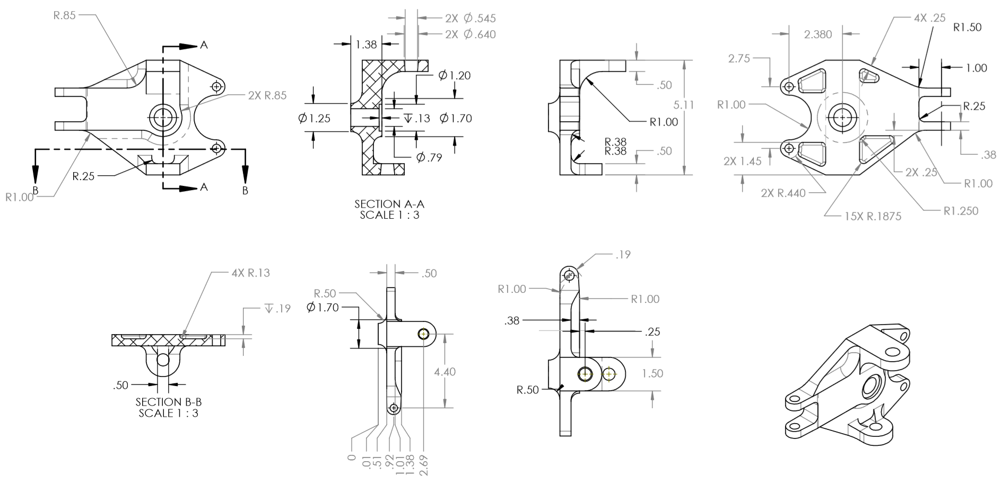
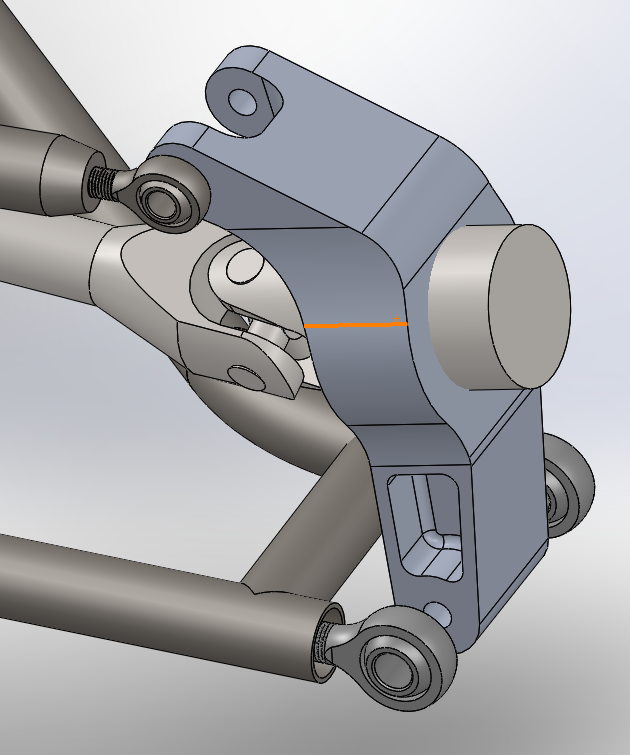
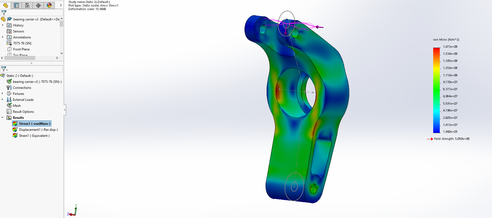
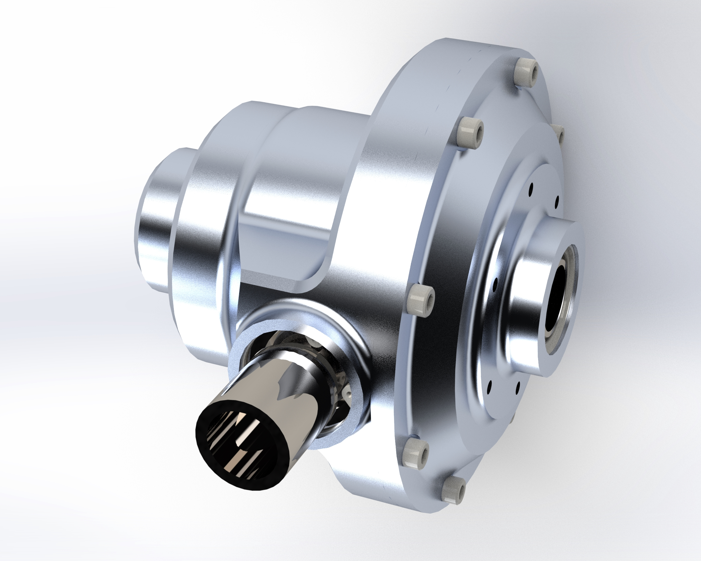
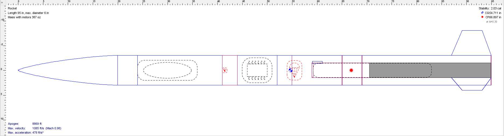
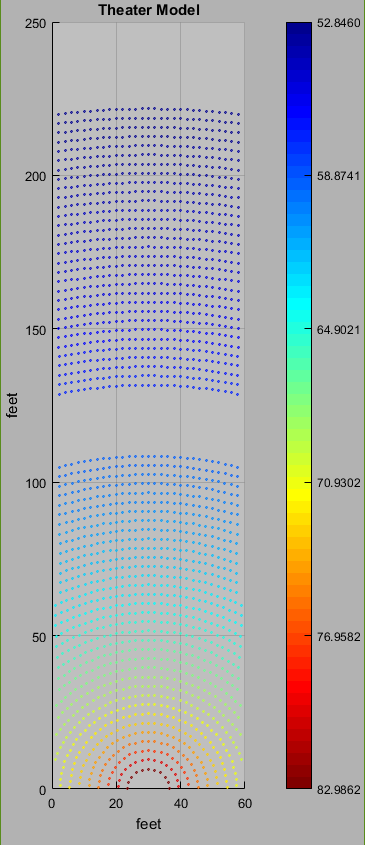

# andy-gothro.github.io
## First off, some stuff about me

I am a Junior Mechanical Engineering student at Gonzaga University, and this is an overview of my work in clubs, classes, and internships. I have over 6 years of experience with Solidworks across many classes and clubs, as well as Matlab from several classes at Gonzaga. I am the Technical President of Gonzaga's Baja SAE team, and Integration/Design Lead of the ASME Rocketry club.

You can reach me at [my email, andrew.gothro@comcast.net](andrew.gothro@comcast.net) or my [Linkedin](https://www.linkedin.com/in/andrew-gothro-58324415b/)

## Below are some pictures and renders of the work I have done as member of of the Baja club.

### My main project last year was the front steering knuckle I redesigned, which had failed in previous years.

This redesign was very successful, with no issues throughout the entire competition. Our front steering and suspension setup worked great.

### Following the competition, I took on a different system redesign, the rear suspension.
Of course things don't always go as planned, and we had some components break, which I led a redesign of afterward.
The rear bearing carrier which attached the rear wheels to the driveshaft and suspension arms broke during the endurance event.

Twice!

Both sides suffered the same issue, with the lower mounting point failing from the stress. I kept this in mind when redesigning the rear suspension from the ground up to avoid such concentrated loads.

I then ran a FE analysis on the part and it held up!

### In the future:
As we move to a four-wheel-drive system, I am leading the design process and implementation of our own drivetrain components for the first time. I have created an initial version of a differential which we would use to drive the front wheels:

You can see the rest of the team's photo albums here:

[19-20 academic year](https://photos.app.goo.gl/GVKg7iayb1dhtsLK7)

[18-19 academic year](https://photos.app.goo.gl/v7NS6NghzjfBwRsY9)

[17-18 academic year](https://photos.app.goo.gl/PrlAercuPOIZDoWB3)

[Or our instagram](https://www.instagram.com/gubajasae/)

## My ASME Rocketry work

As Integration lead, I mainly make sure that the motor, avionics, and recovery systems work together properly. I use an open-source rocket construction tool, Openrocket, to determine weight balance, stability, and maximum altitude based on the components we use. 

We are participating in the [Spaceport America Cup](https://www.spaceportamericacup.com/) in New Mexico in June of 2020, [To follow our progress, our instagram is here](https://www.instagram.com/gonzagarocketry/)

## My 3D-printing experience

I have been working with 3D-printers for 6 years, and I am familiar with design specifically for additive manufacturing. I own my own 3D-printer which enables me to print functional parts and parts for fun. I am a big fan of rapid prototyping and iterative design

## My Matlab experience

At Gonzaga university, I've learned basic Matlab skills, and the biggest project I've done was a program to model sound levels, seat placement, and pricing for theaters of any size. The program I developed for this also produces 3D visualizations of the results.

